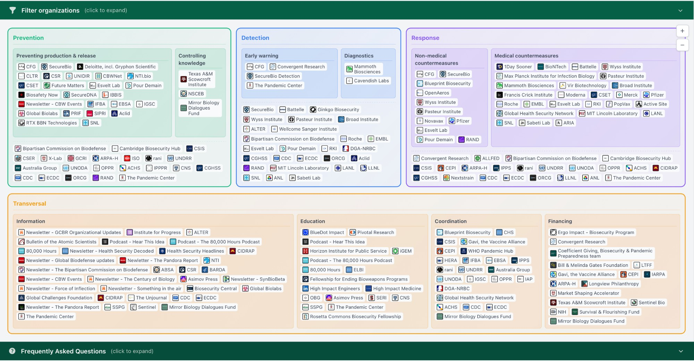

# biosecurity.world

An interactive, filterable map of organizations working on biosecurity — research labs, NGOs, governmental agencies, intergovernmental bodies, think tanks, companies, and media — grouped by what they do (Prevention, Detection, Response, Transversal) and where they operate.

**Live site:** [biosecurity.world](https://biosecurity.world)

[](https://biosecurity.world)

## Data

The underlying database is curated in Notion and refreshed on every deploy (and weekly via a scheduled rebuild). It is openly available in two forms:

- **CSV download:** [`biosecurity.world/data/entries.csv`](https://biosecurity.world/data/entries.csv) — also available [on GitHub](public/data/entries.csv) and linked from the site footer ("Download data (CSV)"). One row per published organization, with columns for label, link, organization type, domains, activities, intervention focuses, location hints, GCBR focus, category trail, description, created date, and Notion URL. Multi-valued fields are joined with `;` for easy use in Excel and pandas.
- **Notion table:** the source of truth, viewable directly via the "Notion" footer link.

If you spot an organization that should be added or corrected, the easiest path is to suggest the change via the Notion table.

## How it works

```
Notion API → NotionClient → Hydrator → domain models → Tree → controllers → Blade views → bare export → static HTML → Cloudflare Pages
```

There is no application database. Notion is queried at build time and the resulting tree is rendered into static HTML by [`bare`](https://github.com/felixdorn/bare), which crawls a local Laravel server during the build. The CSV is generated by an artisan command (`app:export-data`) in the same step.

## Development

Requires PHP 8.3+, Node, and (for the Nix-based dev shell) Nix. The repo includes a `flake.nix` and works with `direnv`.

```bash
direnv allow              # or: nix develop
composer install
pnpm install
cp .env.example .env      # then fill NOTION_DATABASE, NOTION_TOKEN, LOGO_DEV_TOKEN

# In two terminals:
pnpm dev                  # Vite asset server
php artisan serve         # Laravel app server

# Tests / formatting
composer test             # PHPStan level 9 + Pint check
composer lint             # Pint format
pnpm run test:lint        # Prettier check
pnpm run lint             # Prettier format
```

## Deployment

Pushes to `master` (and a Monday-morning cron) trigger `.github/workflows/deploy.yml`, which:

1. Builds Vite assets with `pnpm build`.
2. Runs `php artisan app:export-data` to refresh `public/data/entries.csv`.
3. Boots Laravel and runs `bare export` to render the site to `./dist`.
4. Copies the CSV into `dist/` and deploys to Cloudflare Pages via `wrangler`.
5. Commits the refreshed CSV back to the repo (so GitHub always has the latest snapshot).

The custom domain `biosecurity.world` is attached to the Cloudflare Pages project; the `*.pages.dev` URL is the same content. Cloudflare's built-in auto-deploy is disabled — only the GitHub Actions pipeline produces production deploys.

## Repository layout

```
app/
  Http/Controllers/             — page + partial controllers
  Services/NotionData/          — Notion fetch, hydration, tree
  Console/Commands/
    ExportData.php              — Notion → CSV
    ReportHydrationErrors.php   — surfaces malformed Notion entries
resources/
  js/
    map.ts                      — entry point, panzoom, filter wiring
    layout.ts                   — nested-box layout
    filters.ts                  — bitmask-based filter state
  views/                        — Blade templates
public/
  data/entries.csv              — refreshed on every deploy
.github/workflows/deploy.yml    — full pipeline
```

## Credits

Built and maintained by Alix Pham, Sofya Lebedeva, Johan Täng, and Jérémy Andréoletti, with support from Lin Bowker-Lonnecker, Will Saunter, and Félix Dorn. Logos via [logo.dev](https://logo.dev).
